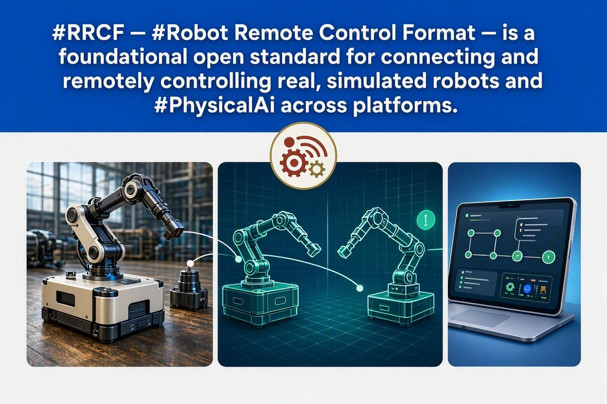
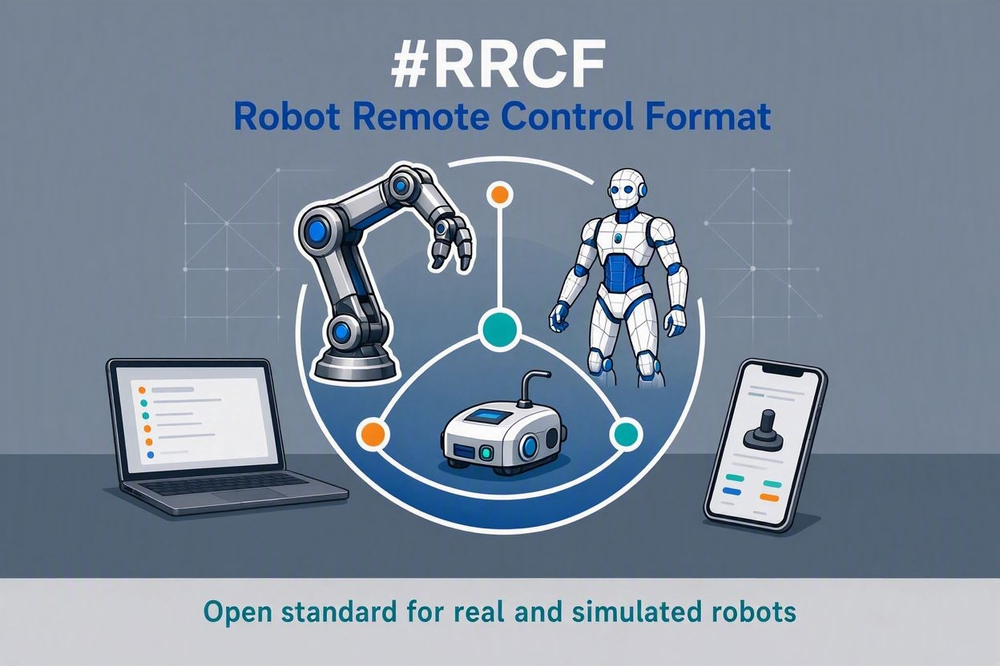
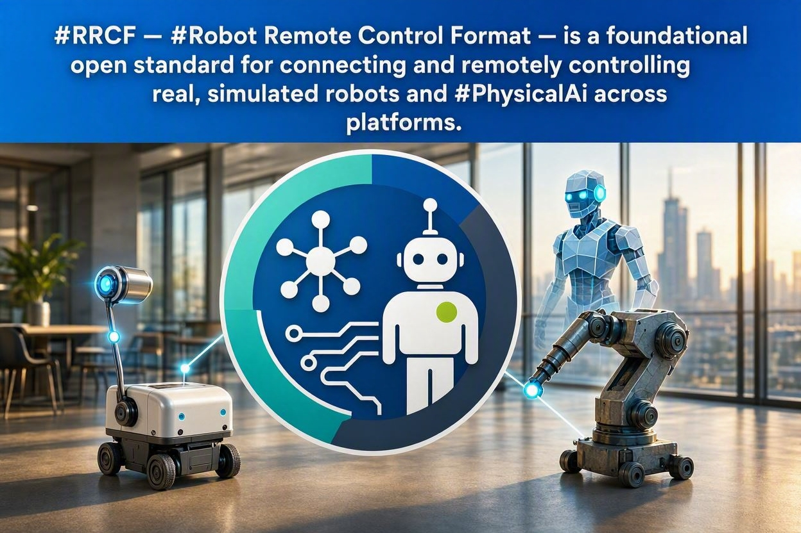

<div align="center">



# RRCF — Robot Remote Control Format

**The Operator Interface Declaration Standard for Physical AI**

[](LICENSE)
[](RRCF_v02_RFC_Specification.pdf)
[](RRCF_v02_RFC_Specification.pdf)
[](https://rrcf-foundation.github.io)

*One `.rrcf` file. Any robot. Any operator — human, another robot, or an AI model.*
*One consistent wire format. Any dashboard, any time-series store, any replay tool.*

[Website](https://rrcf-foundation.github.io) ·
[Specification](RRCF_v02_RFC_Specification.pdf) ·
[Live Controller Demo](https://rrcf-foundation.github.io/demo/index.html) ·
[Converter](https://rrcf-foundation.github.io/tools/converter.html) ·
[RRCA Architecture](architecture/rrca.md) ·
[Adapter Registry](registry/) ·
[ROS 2 Bridge](reference-implementation/rrcf_ros2_bridge/) ·
[Adoption Guide](rrcf-adoption-guide.md)

</div>

---

### Contents

- [What is RRCF?](#what-is-rrcf)
- [Why RRCF exists](#why-rrcf-exists)
- [RRCA, Adopters, and Adapters](#rrca-adopters-and-adapters)
- [The five pillars](#the-five-pillars)
- [Morphology categories](#morphology-categories)
- [A minimal `.rrcf` example](#a-minimal-rrcf-example)
- [Wire format](#wire-format)
- [Also a standard for telemetry, dashboards, and data stores](#also-a-standard-for-telemetry-dashboards-and-data-stores)
- [Recording & playback — rosbag/MCAP + Foxglove](#recording--playback--rosbagmcap--foxglove)
- [VLA integration — RAG for robots](#vla-integration--rag-for-robots)
- [Repository layout](#repository-layout)
- [Generating an `.rrcf` draft from an existing robot](#generating-an-rrcf-draft-from-an-existing-robot)
- [Reference implementation](#reference-implementation)
- [Do you need a physical file, RRCF, or both?](#do-you-need-a-physical-description-file-rrcf-or-both)
- [Relationship to other standards](#relationship-to-other-standards)
- [Conformance — what it takes to interoperate](#conformance--what-it-takes-to-interoperate)
- [Specification](#specification)
- [Versioning & governance](#versioning--governance)
- [Contributing](#contributing)
- [License](#license)

## What is RRCF?

RRCF (**Robot Remote Control Format**) is an open, machine-readable file
format (`.rrcf`) in which a robot declares its **entire operator control
interface**: morphology, locomotion modes, skills, HUD fields, joystick axis
semantics, input modalities (touch, gamepad, voice, gesture, XR), attachment
panels, custom controls, safety limits, and transport endpoints.

Any RRCF-compliant controller — a web dashboard, a fleet console, or a
Vision-Language-Action (VLA) model — reads the `.rrcf` file and renders (or
generates) the correct operator interface. Once an endpoint Adapter has been
published for a robot model, SDK family, or simulator, controllers need no
model-specific integration code.

<div align="center">

</div>

> Just as USB let any peripheral connect to any computer, and Swagger/OpenAPI
> let any client integrate with any REST API without reverse-engineering it,
> RRCF lets any operator surface — human UI or AI agent — control any
> compliant robot from one declared contract.

## Why RRCF exists

Robot deployment is heading toward billions of units across every
morphology — nanorobots, agricultural swarms, industrial humanoids, home
assistants, aerial and marine vehicles. Every one of them needs a human (or
an AI acting on a human's behalf) in the loop somewhere: an operator, a
supervisor, or someone who can hit the e-stop.

Today, every robot ships with its own bespoke controller and its own
integration effort. That doesn't scale. RRCF is the missing **operator
layer** in the robotics standards stack:

| Layer | Standards | Answers |
|---|---|---|
| Physical | URDF, MJCF, SDF, USD, Genesis | *What is this robot made of?* |
| Fleet | VDA 5050, Open-RMF, AMRA-271 | *How are missions assigned to robots?* |
| **Operator** ← RRCF | **RRCF** | **How does any operator — human or AI — control any robot?** |

RRCF doesn't replace URDF/MJCF/SDF (physical description) or VDA 5050/Open-RMF
(fleet mission assignment) — it complements them, sitting above the stack as
the shared control and safety contract.

<div align="center">

</div>

## RRCA, Adopters, and Adapters

RRCF separates the portable operator contract from endpoint-specific integration:

- An **Adopter** is a vendor, integrator, simulator provider, platform, or project implementing RRCF.
- An **Adapter** is the bridge from normalized RRCF controls and telemetry to a vendor SDK, ROS stack, simulator API, serial protocol, or cloud robot API.
- A **`.rrcf.adptr`** file is the ZIP-compatible package containing an Adapter and its manifest. It is installed in addition to the vendor SDK; it does not replace the SDK.
- **RRCA (RRCF Robot Control Agent)** is the generic runtime that loads `.rrcf`, discovers and verifies the matching Adapter, validates commands, and routes telemetry.
- The **RRCF Adapter Registry** is the Foundation-governed, machine-readable catalog of compatible Adapter releases.

```text
Controller / dashboard / VLA
             | RRCF command + telemetry envelopes
             v
RRCA core + category module
             | RRCA Adapter contract
             v
vendor.robot.rrcf.adptr
             | vendor SDK / simulator API / ROS / serial
             v
Robot or simulator
```

Endpoint integration is therefore **Adapter once per model or SDK family; generic controllers thereafter**. Calibration, homing, simulator gains, and other endpoint-specific tuning remain inside vendor firmware, the SDK, or the Adapter. RRCA does not define or parse a calibration record.

Read the [RRCA architecture](architecture/rrca.md), [`.rrcf.adptr` package format](architecture/adapter-package.md), and [RRCF Adapter Registry guidance](registry/README.md).

## The five pillars

1. **Remote Control Standard** — one unified UI for any robot, any morphology, covering both **live control** and **replay** of a previously recorded command stream (same wire format, same skill/mode vocabulary, so a recorded session can be played back through the identical panel it was captured from)
2. **Fleet Management Standard** — complements VDA 5050 / Open-RMF, doesn't compete
3. **Collection & Integration Standard** — universal wire format for any external system: data pipelines, digital twins, ERP/IoT, dashboards and time-series stores (see [below](#also-a-standard-for-telemetry-dashboards-and-data-stores)), and **imitation learning** — every operator session, human or teleoperated demonstration, is already a `(state, action)` trajectory in one consistent schema across every robot, ready to train on without a per-robot data-wrangling step
4. **Safety Standard** — e-stop, watchdog, geofence, speed limits standardized across all robots
5. **Choreography Standard** — synchronized multi-robot missions via `.rrcm` files

## Morphology categories

RRCF-1.0 defines twelve canonical robot morphology categories, plus an open
`custom` category for anything not yet enumerated:

`wheeled` · `legged` · `loco_manip` · `wheeled_humanoid` · `full_humanoid` ·
`manipulator` · `aerial` · `marine_surface` · `marine_sub` ·
`industrial_vehicle` · `agri_vehicle` · `custom`

Each robot declares exactly one primary category, with additional
capabilities layered on as `<attachments>` (arms, grippers, sensors, tools).

## A minimal `.rrcf` example

```xml
<?xml version="1.0" encoding="UTF-8"?>
<rrcf version="1.0" xmlns="https://rrcf.io/schema/1.0">
  <meta>
    <name>Unitree Go2 + Z1 Arm</name>
    <vendor>Unitree Robotics</vendor>
    <model>Go2-Z1</model>
    <physical_ref format="urdf" path="go2_z1.urdf"/>
  </meta>

  <primary category="legged">
    <locomotion axes="vx vy wz" max_vx="1.5" max_vy="0.5" max_wz="2.0"/>
    <modes>stand trot bound crawl prone</modes>
    <body_pose pitch="true" roll="true" height="true"/>
  </primary>

  <attachments>
    <attach type="manipulator" id="arm_z1" mount="torso_top" dof="6">
      <modes>stow reach teach replay</modes>
      <ee_control cartesian="true"/>
    </attach>
  </attachments>

  <skills>
    <skill id="sit"   label="Sit"   standard="true" cmd='{"mode":"sit"}'/>
    <skill id="stand" label="Stand" standard="true" cmd='{"mode":"stand"}'/>
    <!-- Vendor-custom skills — VLA reads these at runtime, no retraining -->
    <skill id="heel_stretch" label="Yoga Pose" cmd='{"mode":"custom_01"}'/>
  </skills>

  <safety>
    <estop required="true" topic="/rrcf/go2/estop" qos="2"/>
    <watchdog timeout_ms="500" action="halt"/>
    <speed_limit max_vx="1.5" max_wz="2.0"/>
  </safety>

  <transport>
    <endpoint role="operator_cmd" protocol="rrcf_mqtt"
              topic="/rrcf/go2/cmd" broker="${MQTT_BROKER}"/>
    <endpoint role="telemetry" protocol="mqtt"
              topic="/rrcf/go2/state" frequency_hz="10"/>
  </transport>
  <extensions/>
</rrcf>
```

The full annotated example (HUD, all five input modalities, custom controls,
telemetry) is in the [spec, §7.1](RRCF_v02_RFC_Specification.pdf).

## Wire format

Every input modality — touch, gamepad, voice, gesture, XR, or a VLA model —
produces the same normalized command message on the wire:

```json
{
  "rrcf": "1.0",
  "category": "legged",
  "type": "cmd",
  "lx": 0.75, "ly": 0.0, "rx": -0.25, "ry": 0.0,
  "speed": 0.60,
  "mode": "trot",
  "skill": null,
  "estop": false,
  "input": "touch_web",
  "twist": {
    "linear":  { "x": 0.75, "y": 0.0, "z": 0.0 },
    "angular": { "x": 0.0,  "y": 0.0, "z": -0.25 }
  },
  "ts": 1719000000000
}
```

Axes are always normalized to `[-1.0, 1.0]`, `estop` is always present, and a
ROS 2 `geometry_msgs/Twist`-shaped sub-object is always included — so any
consumer, from a browser UI to a ROS 2 node, can read it directly.

## Also a standard for telemetry, dashboards, and data stores

RRCF is a control standard first, but the same property that makes it a
control standard — one consistent field schema (`lx/ly/rx/ry`, `estop`,
`twist`, `mode`, `skill`, `ts`, plus whatever's declared under
`<telemetry>`) across every robot and every morphology category — makes it
equally a **telemetry and time-series standard**, for free, with no separate
schema to design:

- **Dashboards** — a fleet dashboard built against the RRCF schema renders
  the same battery/speed/temp/custom-field widgets for a wheeled robot, a
  drone, and a humanoid, because the field names and shapes don't change
  across categories. No per-robot dashboard config.
- **Time-series stores** — writing RRCF telemetry straight into InfluxDB,
  TimescaleDB, Prometheus, or any time-series database gives you one
  consistent measurement schema across your entire fleet, not one schema per
  vendor. Queries, alerts, and retention policies are written once and work
  for every robot that speaks RRCF.
- **Data streams** — the same `operator_cmd`/`telemetry` MQTT (or WebSocket)
  endpoints declared in `<transport>` are just as usable as a generic
  pub/sub data stream for any consumer that wants live robot state, not only
  for the control loop itself.

This is the same "one schema, many robots" property described in the
[VLA/RAG section](#vla-integration--rag-for-robots) below and in the
[rosbag/MCAP + Foxglove use case](#recording--playback--rosbagmcap--foxglove)
— control, dashboards, storage, and recording all reuse one declared field
schema instead of four separate ones.

## Recording & playback — rosbag/MCAP + Foxglove

If a robot's command and telemetry topics are already emitted in RRCF's
wire format — the same `lx/ly/rx/ry`, `estop`, `twist`, `ts` field names
across every robot and every category — then recording them into an
[MCAP](https://mcap.dev/) file (which natively supports arbitrary
JSON-schema channels) gets you a real, concrete win today, not a
hypothetical one:

- **[Foxglove](https://foxglove.dev/)'s generic Plot, Raw, and 3D panels can
  render straight off the RRCF schema.** Today, a Foxglove layout is
  hand-built per robot, because every vendor's topic names and fields
  differ — a battery field might be `battery_pct`, `batt`, or `soc`
  depending on who built the robot. With RRCF, it's always `battery` under
  `<telemetry>`, `lx`/`ly`/`rx`/`ry` for stick input, `estop`/`twist`/`ts` on
  every message, regardless of vendor or morphology category.
- **One layout template works for any RRCF-compliant robot.** Build a
  Foxglove layout once against the RRCF wire format, and it works
  unmodified for a wheeled robot, a drone, or a humanoid — the schema is
  the same, only the values differ.
- **rosbag/MCAP recordings become directly comparable across robots and
  vendors**, since the recorded fields mean the same thing everywhere. A
  `sit` skill call or an `estop:true` event looks identical in the recording
  whether it came from a Go2 or a Franka arm.
- This is buildable now, on top of what's already public: emit RRCF wire
  format on your existing topics, record with `ros2 bag record` (Foxglove's
  MCAP writer works the same way), and open the result in Foxglove — no new
  tooling required on either side of the pipeline.

## VLA integration — RAG for robots

A `.rrcf` file is designed to be loaded as context by a Vision-Language-Action
model at session start, the same way a document is retrieved for RAG:

- Declared skills extend the VLA's action vocabulary at runtime — **no
  fine-tuning required**.
- Vendor-specific skills (`heel_stretch`, `seed_row_align`, ...) become
  available to the model instantly, because the skill declaration *is* the
  context.
- Generated commands are bounded by the `<safety>` block's declared limits.

This is what makes thousands of robots × hundreds of skills tractable: RRCF
makes each robot's skill set available on load, instead of requiring it to be
trained in.

## Repository layout

```
RRCF/
├── README.md                              this file
├── LICENSE                                Apache 2.0
├── RRCF_v02_RFC_Specification.pdf/.docx   full RFC-style spec (source of truth)
├── rrcf-adoption-guide.md                 adopter guidance and publication paths
├── architecture/
│   ├── rrca.md                            RRCA runtime and Adapter boundary
│   └── adapter-package.md                 .rrcf.adptr package format
├── registry/
│   ├── index.json                         Foundation Adapter catalog
│   ├── schema/                            machine-readable manifest schema
│   └── adapters/                          reviewed Adapter entries
├── images/                                diagrams used in this README
├── reference-implementation/
│   ├── RCSP1_UniversalRobotControl.jsx    controller-side reference: React/JSX operator UI (9 morphology categories)
│   └── rrcf_ros2_bridge/                  robot-side reference: ROS 2 node for quick RRCF-transport compliance
├── converter-mjcf/                        MJCF → .rrcf draft generator (+ sample .rrcf output)
│   ├── mjcf_to_rrcf.py                    CLI, uses the real MuJoCo compiler
│   ├── mjcf_to_rrcf.html                  drag-and-drop browser version, no install
│   ├── humanoid.rrcf / car.rrcf           example generated drafts
└── to-rrcf-converters/files/              general MJCF/URDF/SDF → .rrcf converter toolkit
    ├── convert_to_rrcf.py                 CLI, format auto-detected from root XML tag
    └── convert_to_rrcf.html               browser version
```

## Generating an `.rrcf` draft from an existing robot

RRCF ships converters that read your existing physical description file
(URDF/MJCF/SDF) and emit a draft `.rrcf` — you fill in the vendor-specific
skills, safety limits, and transport credentials the converter can't infer.
Try it live, no install: **[rrcf-foundation.github.io/tools/converter.html](https://rrcf-foundation.github.io/tools/converter.html)**.

```bash
cd to-rrcf-converters/files
pip install mujoco --break-system-packages   # only needed for MJCF sources

python3 convert_to_rrcf.py humanoid.xml --vendor "MuJoCo Playground"
python3 convert_to_rrcf.py ur3.urdf --vendor "Universal Robots"
python3 convert_to_rrcf.py model.sdf --category wheeled
```

No install needed: open `convert_to_rrcf.html` in a browser and drag a file
in — everything runs client-side.

| Source format | Root tag | Status |
|---|---|---|
| MJCF | `<mujoco>` | Supported (`pip install mujoco`) |
| URDF | `<robot>` | Supported (pure XML parse) |
| SDF | `<sdf>` | Supported (pure XML parse) |
| USD | n/a | Detected, not yet converted — export to URDF/MJCF first |
| xacro | n/a | Detected, not yet converted — run `xacro` first |

### Why convert instead of publishing the physical file directly?

A URDF/MJCF/SDF/USD file typically encodes far more than a controller needs —
exact link lengths, mass and inertia, gear ratios, full mesh geometry. That's
often the part of a design a vendor most wants to protect; it's close to a
manufacturing blueprint. An `.rrcf` file only needs to declare the **control
surface** — actuator names and ranges, category, skills, safety limits,
transport — the same scope you'd normally hand a third-party integrator as
API docs, with none of the mass/geometry data a competitor would actually
want. That makes **"private physical file, public RRCF"** a coherent pattern,
not an edge case — see the [Adoption Guide](rrcf-adoption-guide.md) for the
full breakdown of when to publish each file openly vs. privately.

### The converter is a draft generator, not a certifier

It can only extract what's mechanically inferable from joint/actuator names
and topology. It cannot infer, and will only emit as placeholders or `TODO`
stubs:

- **Skills** — your actual named behaviors and their command payloads. Only standard skills (stand/sit) are stubbed where the category implies them.
- **Safety limits** — your real e-stop topic, watchdog timeout, geofence, and speed limits.
- **Transport credentials** — your actual MQTT broker, topic namespace, or WebSocket port.
- **Morphology category** — a name-based heuristic (hip/knee/ankle → leg, shoulder/elbow/wrist → arm, wheel/steer → wheeled). Usually right for real robots, shakier for generic/test models — always confirm `<primary category>` by hand.
- **Which actuators matter operationally** — `custom_controls` is capped at 5 per spec (RRCF is an operator panel, not a raw joint-teleop protocol); unmapped actuators are listed in a comment for you to fold into `<skills>` or a dedicated `<attach>` block.

Treat every converter output as scaffolding, not a finished file — fill in
the TODO-marked blocks and verify the category guess before it drives an
actual robot or is published for third-party integrators. See
[`to-rrcf-converters/files/README.md`](to-rrcf-converters/files/README.md)
for the full converter documentation.

## Reference implementation

Two reference implementations cover both sides of the conformance contract:

- **Controller side** —
  [`reference-implementation/RCSP1_UniversalRobotControl.jsx`](reference-implementation/RCSP1_UniversalRobotControl.jsx)
  is a working React operator console covering all nine base morphology
  registries (wheeled, legged, loco-manipulation, wheeled humanoid, full
  humanoid, manipulator, aerial, marine surface, marine sub) — joystick axis
  mapping, mode/skill button legends, telemetry fields, and ROS 2 `Twist`
  translation, all driven from the category registry rather than per-robot
  code. **[Try it live in your browser](https://rrcf-foundation.github.io/demo/index.html)**
  — no install, switches between all nine categories.

- **Robot-side Adapter reference** —
  [`reference-implementation/rrcf_ros2_bridge/`](reference-implementation/rrcf_ros2_bridge/)
  is the first bootstrap Adapter and the precursor to an RRCA-loadable
  `.rrcf.adptr` package. It makes an *existing* ROS 2 robot RRCF-transport
  compliant without replacing its control stack: it loads the robot's
  `.rrcf` file, subscribes to the declared MQTT `operator_cmd` endpoint,
  translates commands to `geometry_msgs/Twist` on `/cmd_vel`, and enforces
  the watchdog, e-stop latching, and speed-limit clamping. It is listed in
  the Registry as an experimental source reference until a packaged RRCA
  Adapter release and conformance report are available. See its own
  [README](reference-implementation/rrcf_ros2_bridge/README.md) for setup.

## Do you need a physical description file, RRCF, or both?

Short version: if the consumer is a physics engine, planner, or renderer, it
never touches RRCF. If the consumer is an operator UI or an AI agent issuing
high-level commands — and the physics runs somewhere else — it never needs
the physical file. See the full breakdown, including guidance on when to
publish your physical file privately but your RRCF publicly, in the
[**RRCF Adoption Guide**](rrcf-adoption-guide.md).

## Relationship to other standards

RRCF complements, and does not compete with, existing robotics standards:

| Standard | Covers | Relationship to RRCF |
|---|---|---|
| VDA 5050 v3.0 | Fleet mission assignment (wheeled AGV/AMR) | RRCF sits above it — operator UI, all 12 morphologies |
| Open-RMF | Multi-robot task allocation, ROS 2 | Different layer — RRCF adds the operator declaration |
| URDF / MJCF / SDF / USD | Physical description — kinematics, geometry | RRCF references these via `physical_ref`, doesn't replace them |
| NVIDIA Halos | Functional safety (IEC 61508) | Halos governs internal failure; RRCF declares external behavioral limits |
| USB HID / W3C Gamepad API | Raw hardware input | RRCF provides the semantic layer above raw axes/buttons |

## Conformance — what it takes to interoperate

RRCF conformance covers the **controller**, **RRCA runtime**, and **endpoint
Adapter/robot** boundaries. A human UI, fleet console, another robot, or VLA
model sends the same declared contract; RRCA and a compatible Adapter perform
the endpoint-specific integration once rather than requiring every controller
to integrate every SDK.

**A compliant robot MUST:**
- Expose a valid `<rrcf version="1.0">` block, standalone or embedded in its physical description file.
- Accept RRCF wire-format JSON on at least one declared transport endpoint.
- Halt **all** motion immediately on `estop:true` — no exceptions.
- Halt if no valid command arrives within the declared watchdog timeout.
- Publish telemetry on every declared field at ≥1 Hz.
- Implement e-stop in hardware, independent of the network link (spec §13).

**A compliant controller MUST:**
- Parse the `.rrcf` file standalone — no other description format required.
- Render the core panel (joysticks, e-stop, speed, telemetry) for **every** category, without per-robot code.
- Render category/skill/attachment-specific panels purely from the declaration.
- Support `touch_web` as the baseline input modality.
- Include an `estop` field and a `Twist` sub-object in **every** transmitted command.
- Normalize all input axes to `[-1.0, 1.0]` in wire-format output.
- Reject any command exceeding the robot's declared safety limits — applies equally to human input and VLA-generated commands.

**A conforming RRCA and Adapter deployment MUST:**
- Load and validate the `.rrcf` declaration before accepting commands.
- Verify Adapter identity, compatibility, and package integrity before activation.
- Map required controls, skills, telemetry, and target safe-state behavior.
- Reject declaration/endpoint mismatches instead of silently claiming support.
- Keep deployment credentials and unit-specific calibration outside public declarations and Registry records.

This split is what makes a human operator, a robot commanding another robot,
and a VLA agent fungible from the robot's point of view: all three speak the
same wire format and are held to the same safety-limit contract, so the
robot never needs to know which kind of operator it's talking to.

Full requirements, including transport security and rate-limiting: spec §11–§13.

## Specification

The complete RFC-style specification — motivation, the five pillars, full
`.rrcf` schema, wire format, VLA/RAG integration, input modality table,
conformance requirements, security considerations, and governance/versioning
roadmap — lives in:

- [`RRCF_v02_RFC_Specification.pdf`](RRCF_v02_RFC_Specification.pdf)
- [`RRCF_v02_RFC_Specification.docx`](RRCF_v02_RFC_Specification.docx)

## Versioning & governance

RRCF follows semantic versioning. RRCF-1.0 defines all 12 morphology
categories, the five pillars, and the five input modalities. Category
proposals go through: proposal → 60-day review → draft → three independent
implementations → ratification → publication.

| Version | Planned additions |
|---|---|
| RRCF-1.0 | 12 categories, all 5 pillars, 5 input modalities |
| RRCF-1.1 | Voice modality refinements, gesture spec, XR training |
| RRCF-2.0 | World-context block, benchmarking block, RL reward hints, new categories (medical, surgical, micro, exoskeleton, soft robot, swarm) |
| RRCF-3.0 | Neural interface, zero-G thruster primitive |

## Contributing

RRCF is published under Apache License 2.0. Issues and pull requests for the
spec, converters, and reference implementation are welcome — see
[LICENSE](LICENSE) for terms.

## License

[Apache License 2.0](LICENSE)
