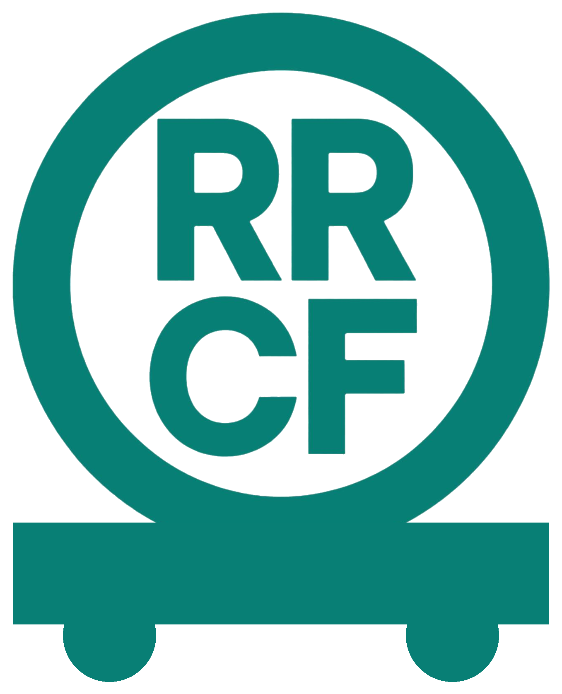
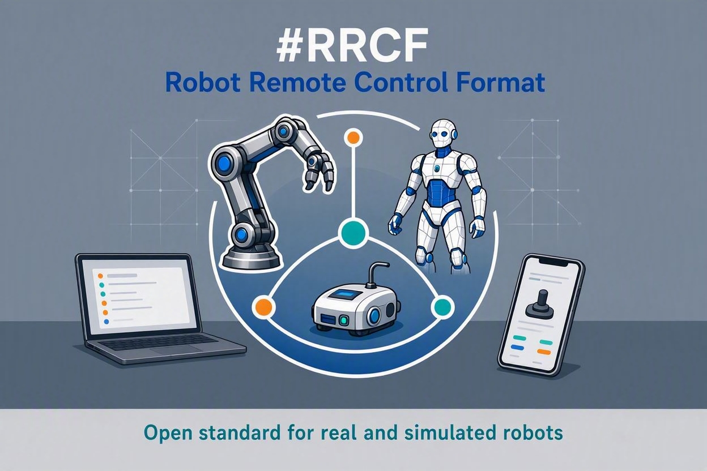
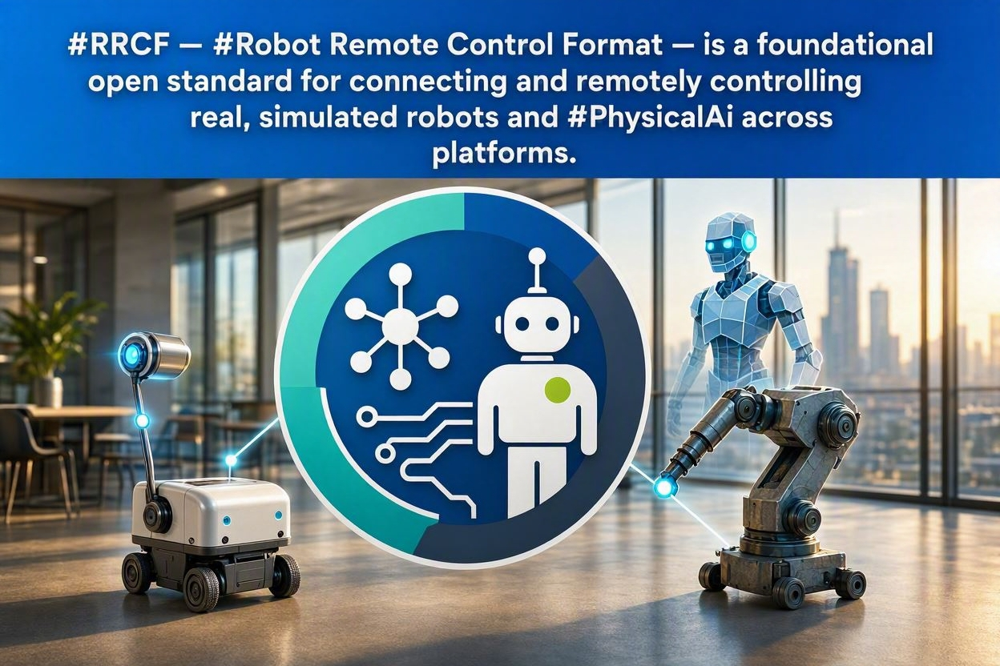

# .RRCF

## Robot Remote Control Format

# Robots to the World, Made Easy.

*An open standard that seamlessly connects robots, controllers, operators, AI and the world around them.*

<div align="center">

[](LICENSE)
[](spec/RRCF_v04_RFC_Specification.md)
[](spec/RRCF_v04_RFC_Specification.md)
[](https://rrcf-foundation.github.io)

**Are you .RRCF Ready?** → [Explore the Standard](RRCF_v04_RFC_Specification.pdf)

[Website](https://rrcf-foundation.github.io) ·
[Specification (Markdown)](spec/RRCF_v04_RFC_Specification.md) ·
[Specification (PDF)](RRCF_v04_RFC_Specification.pdf) ·
[Live Controller Demo](https://rrcf-foundation.github.io/demo/index.html) ·
[Converter](https://rrcf-foundation.github.io/tools/converter.html) ·
[RRCA Architecture](architecture/rrca.md) ·
[Adapter Registry](registry/) ·
[Conformance](conformance/) ·
[ROS 2 Bridge](reference-implementation/rrcf_ros2_bridge/) ·
[Adoption Guide](rrcf-adoption-guide.md)

</div>

---

### Contents

- [What is RRCF?](#what-is-rrcf)
- [Why RRCF exists](#why-rrcf-exists)
- [RRCA, Adopters, and Adapters](#rrca-adopters-and-adapters)
- [The five pillars](#the-five-pillars)
- [Morphology categories](#morphology-categories)
- [A minimal `.rrcf` example](#a-minimal-rrcf-example)
- [Wire format](#wire-format)
- [Telemetry is not a by-product — it is half the contract](#telemetry-is-not-a-by-product--it-is-half-the-contract)
- [Vehicle control and authority tiers](#vehicle-control-and-authority-tiers)
- [Data replay — one converter per source, not per robot](#data-replay--one-converter-per-source-not-per-robot)
- [Environment, composition, and identity](#environment-composition-and-identity)
- [Recording & playback — rosbag/MCAP + Foxglove](#recording--playback--rosbagmcap--foxglove)
- [VLA integration — RAG for robots](#vla-integration--rag-for-robots)
- [Repository layout](#repository-layout)
- [Generating an `.rrcf` draft from an existing robot](#generating-an-rrcf-draft-from-an-existing-robot)
- [Reference implementation](#reference-implementation)
- [Do you need a physical file, RRCF, or both?](#do-you-need-a-physical-description-file-rrcf-or-both)
- [Relationship to other standards](#relationship-to-other-standards)
- [Conformance — what it takes to interoperate](#conformance--what-it-takes-to-interoperate)
- [Conformance tooling — the three enforcement layers](conformance/README.md)
- [Specification](#specification)
- [Versioning & governance](#versioning--governance)
- [Contributing](#contributing)
- [License](#license)

## What is RRCF?

RRCF (**Robot Remote Control Format**) is an open, machine-readable file
format (`.rrcf`) in which a robot declares its **entire operator control
interface**: morphology, locomotion modes, skills, HUD fields, joystick axis
semantics, input modalities (touch, gamepad, voice, gesture, XR), attachment
panels, custom controls, safety limits, and transport endpoints.

Any RRCF-compliant controller — a web dashboard, a fleet console, or a
Vision-Language-Action (VLA) model — reads the `.rrcf` file and renders (or
generates) the correct operator interface. Once an endpoint Adapter has been
published for a robot model, SDK family, or simulator, controllers need no
model-specific integration code.

<div align="center">

</div>

> Just as USB let any peripheral connect to any computer, and Swagger/OpenAPI
> let any client integrate with any REST API without reverse-engineering it,
> RRCF lets any operator surface — human UI or AI agent — control any
> compliant robot from one declared contract.

## Why RRCF exists

Robot deployment is heading toward billions of units across every
morphology — nanorobots, agricultural swarms, industrial humanoids, home
assistants, aerial and marine vehicles. Every one of them needs a human (or
an AI acting on a human's behalf) in the loop somewhere: an operator, a
supervisor, or someone who can hit the e-stop.

Today, every robot ships with its own bespoke controller and its own
integration effort. That doesn't scale. RRCF is the missing **operator
layer** in the robotics standards stack:

| Layer | Standards | Answers |
|---|---|---|
| Physical | URDF, MJCF, SDF, USD, Genesis | *What is this robot made of?* |
| Fleet | VDA 5050, Open-RMF, AMRA-271 | *How are missions assigned to robots?* |
| **Operator** ← RRCF | **RRCF** | **How does any operator — human or AI — control any robot?** |

RRCF doesn't replace URDF/MJCF/SDF (physical description) or VDA 5050/Open-RMF
(fleet mission assignment) — it complements them, sitting above the stack as
the shared control and safety contract.

<div align="center">

</div>

## RRCA, Adopters, and Adapters

RRCF separates the portable operator contract from endpoint-specific integration:

- An **Adopter** is a vendor, integrator, simulator provider, platform, or project implementing RRCF.
- An **Adapter** is the bridge from normalized RRCF controls and telemetry to a vendor SDK, ROS stack, simulator API, serial protocol, or cloud robot API.
- A **`.rrcf.adptr`** file is the ZIP-compatible package containing an Adapter and its manifest. It is installed in addition to the vendor SDK; it does not replace the SDK.
- **RRCA (RRCF Robot Control Agent)** is the generic runtime that loads `.rrcf`, discovers and verifies the matching Adapter, validates commands, and routes telemetry.
- The **RRCF Adapter Registry** is the Foundation-governed, machine-readable catalog of compatible Adapter releases.

```text
Controller / dashboard / VLA
             | RRCF command + telemetry envelopes
             v
RRCA core + category module
             | RRCA Adapter contract
             v
vendor.robot.rrcf.adptr
             | vendor SDK / simulator API / ROS / serial
             v
Robot or simulator
```

Endpoint integration is therefore **Adapter once per model or SDK family; generic controllers thereafter**. Calibration, homing, simulator gains, and other endpoint-specific tuning remain inside vendor firmware, the SDK, or the Adapter. RRCA does not define or parse a calibration record.

Read the [RRCA architecture](architecture/rrca.md), [`.rrcf.adptr` package format](architecture/adapter-package.md), and [RRCF Adapter Registry guidance](registry/README.md).

## The five pillars

1. **Remote Control Standard** — one unified UI for any robot, any morphology, covering live control and **replay** of a command stream already recorded in RRCF wire format, through the same panel and endpoint contract. For on-road vehicles the same panel renders either a full remote-driving control surface or a remote-assistance advisory surface, gated by the declared [authority tier](#vehicle-control-and-authority-tiers).
2. **Fleet Management Standard** — complements VDA 5050 / Open-RMF, doesn't compete
3. **Collection & Integration Standard** — because command and telemetry share one wire format, integration runs both directions: a robot streams state out to a pipeline, and a pre-recorded or converted command stream replays back in on a declared [replay endpoint](#data-replay--one-converter-per-source-not-per-robot). One converter per source format (simulator, egocentric demonstration, an imitation-learning dataset) reaches any RRCF-compliant robot or simulator — the converter is a separate implementation artifact; RRCF does not itself infer commands from raw video or tactile data.
4. **Safety Standard** — e-stop, watchdog, geofence, speed limits, and vehicle authority tiers standardized across all robots
5. **Choreography Standard** — synchronized multi-robot missions via `.rrcm` files

## Morphology categories

RRCF-1.0 defines thirteen canonical robot morphology categories. Twelve are
specific morphologies; the thirteenth, `custom`, is deliberately open for
anything not yet enumerated:

`wheeled` · `legged` · `loco_manip` · `wheeled_humanoid` · `full_humanoid` ·
`manipulator` · `aerial` · `marine_surface` · `marine_sub` ·
`industrial_vehicle` · `agri_vehicle` · `road_vehicle` · `custom`

`road_vehicle` (on-road AV/EV — steering/throttle/brake, SAE L2–L4, remote
driving vs. remote assistance) is new in v0.4; see
[spec §6, §7.3](spec/RRCF_v04_RFC_Specification.md#6-morphology-category-taxonomy).

Each robot declares exactly one primary category, with additional
capabilities layered on as `<attachments>` (arms, grippers, sensors, tools).

A category is not just a label. It determines which control axes and which
telemetry fields the robot is *required* to declare — an aerial vehicle owes
`altitude`, a fixed manipulator owes neither a locomotion axis nor a battery
reading. That matrix is machine-readable in
[`conformance/profiles/category-profiles.json`](conformance/profiles/category-profiles.json)
and enforced by [`rrcf-conformance lint`](conformance/README.md).

## A minimal `.rrcf` example

```xml
<?xml version="1.0" encoding="UTF-8"?>
<rrcf version="1.0" xmlns="https://rrcf.io/schema/1.0">
  <meta>
    <name>Unitree Go2 + Z1 Arm</name>
    <vendor>Unitree Robotics</vendor>
    <model>Go2-Z1</model>
    <physical_ref format="urdf" path="go2_z1.urdf"/>
  </meta>

  <primary category="legged">
    <locomotion axes="vx vy wz" max_vx="1.5" max_vy="0.5" max_wz="2.0"/>
    <modes>stand trot bound crawl prone</modes>
    <body_pose pitch="true" roll="true" height="true"/>
  </primary>

  <attachments>
    <attach type="manipulator" id="arm_z1" mount="torso_top" dof="6">
      <modes>stow reach teach replay</modes>
      <ee_control cartesian="true"/>
    </attach>
  </attachments>

  <skills>
    <skill id="sit"   label="Sit"   standard="true" cmd='{"mode":"sit"}'/>
    <skill id="stand" label="Stand" standard="true" cmd='{"mode":"stand"}'/>
    <!-- Vendor-custom skills — VLA reads these at runtime, no retraining -->
    <skill id="heel_stretch" label="Yoga Pose" cmd='{"mode":"custom_01"}'/>
  </skills>

  <telemetry>
    <!-- Universal fields every category owes, so an operator sees actual state -->
    <field id="estop_state" type="enum" values="clear engaged"
           label="E-Stop" widget="badge"/>
    <field id="health" type="enum" values="ok warn fault"
           label="Health" widget="badge"/>
    <!-- Category + vendor fields, each self-describing (type, unit, range) -->
    <field id="battery" type="number" unit="%" min="0" max="100"
           warn_below="20" label="Battery" widget="gauge"/>
    <field id="speed" type="number" unit="m/s" min="0" max="1.5"
           label="Speed" widget="gauge"/>
    <field id="temp" type="number" unit="C" max="55" warn_above="55"
           label="Temp" widget="gauge"/>
  </telemetry>

  <safety>
    <estop required="true" topic="/rrcf/go2/estop" qos="2"/>
    <watchdog timeout_ms="500" action="halt"/>
    <speed_limit max_vx="1.5" max_wz="2.0"/>
  </safety>

  <transport>
    <endpoint role="operator_cmd" protocol="rrcf_mqtt"
              topic="/rrcf/go2/cmd" broker="${MQTT_BROKER}"/>
    <endpoint role="telemetry" protocol="mqtt"
              topic="/rrcf/go2/state" frequency_hz="10"/>
  </transport>
  <extensions/>
</rrcf>
```

This minimal example declares the universal `estop_state` and `health` fields
plus self-describing category telemetry, so it satisfies the
[category profile](conformance/profiles/category-profiles.json) that
`rrcf-conformance lint` enforces. The full annotated example (HUD, all five
input modalities, custom controls, complete telemetry) is in the
[spec §7.1](spec/RRCF_v04_RFC_Specification.md#71-complete-example--unitree-go2--z1-arm).

## Wire format

Every input modality — touch, gamepad, voice, gesture, XR, or a VLA model —
produces the same normalized command message on the wire:

```json
{
  "rrcf": "1.0",
  "category": "legged",
  "type": "cmd",
  "lx": 0.75, "ly": 0.0, "rx": -0.25, "ry": 0.0,
  "speed": 0.60,
  "mode": "trot",
  "skill": null,
  "estop": false,
  "input": "touch_web",
  "twist": {
    "linear":  { "x": 0.75, "y": 0.0, "z": 0.0 },
    "angular": { "x": 0.0,  "y": 0.0, "z": -0.25 }
  },
  "ts": 1719000000000
}
```

Axes are always normalized to `[-1.0, 1.0]`, and `rrcf`, `category`, `type`,
`estop`, and `ts` are present on every message regardless of morphology.

A ROS 2 `geometry_msgs/Twist`-shaped sub-object is included whenever the
robot's category declares locomotion axes — which is every category except
`manipulator` and `custom` — so any consumer, from a browser UI to a ROS 2
node, can read it directly. It is deliberately *not* universal: a bolted-down
arm has no mobile base, and RRCA
[must not assume mobile-base `Twist` semantics for every category](architecture/rrca.md).
Which categories require it is declared in
[`conformance/profiles/category-profiles.json`](conformance/profiles/category-profiles.json)
and checked against real traffic by
[`rrcf-conformance check-session`](conformance/README.md).

## Telemetry is not a by-product — it is half the contract

Nobody drives a car by watching only the road. You watch the speedometer, the
fuel gauge, the temperature light. Take the dashboard out and you don't have a
car that drives slightly worse — you have a car nobody should be driving,
because the driver can no longer tell whether the last input did what they
intended.

Commanding a robot is the same. `estop:true` is not a stop; it is a *request*
to stop. Only `estop_state` coming back tells the operator the robot actually
stopped. A command stream without a state stream is open-loop, and open-loop
teleoperation of a physical machine is not a reduced feature set — it is an
unsafe one.

So RRCF does not treat telemetry as a bonus that falls out of the control
format. It declares both halves in one file, and a declaration that omits a
`telemetry` endpoint is **rejected** — you cannot safely command what you
cannot observe:

```console
$ rrcf-conformance lint no-telemetry-endpoint.rrcf
FAIL  no-telemetry-endpoint.rrcf
      ERROR   schema [transport/endpoints]: A declaration with no telemetry
      endpoint is not safely commandable: an operator cannot be asked to
      command a robot whose current state they cannot see.
```

### The self-description contract

The dashboard analogy has a second half. A speedometer is useful because it is
labelled — the numbers mean km/h, the redline is marked, you know what you are
looking at without a manual. RRCF requires the same of every telemetry field:

```xml
<field id="battery" type="number" unit="%" min="0" max="100"
       warn_below="20" label="Battery" widget="gauge"/>
```

> A generic controller, dashboard, or VLA MUST be able to render and interpret
> every declared field using only the declaration — no per-robot code, no
> out-of-band documentation, no vendor lookup table.

A controller that has never heard of this robot can now draw the gauge, scale
it correctly, and turn it amber at 20%. The moment a consumer has to know that
*this* vendor's `soc` means battery percent, the operator layer has stopped
being portable. Full rules, and how they are enforced:
[**conformance/README.md**](conformance/README.md).

### What that buys, downstream

Because command and state share one declared, self-describing schema, the
things normally built per-vendor become build-once:

- **Dashboards** — a fleet dashboard renders the same battery/speed/temp
  widgets for a wheeled robot, a drone, and a humanoid, because the field
  names, units, and ranges are declared rather than assumed. No per-robot
  dashboard config.
- **Time-series stores** — writing RRCF telemetry into InfluxDB, TimescaleDB,
  or Prometheus gives one consistent measurement schema across the fleet, not
  one per vendor. Queries, alerts, and retention policies are written once.
- **Data streams** — the `operator_cmd`/`telemetry` endpoints declared in
  `<transport>` work as a generic pub/sub stream for any consumer wanting live
  robot state, not only the control loop.
- **Imitation learning** — every operator session is already a
  `(state, action)` trajectory in one schema, because the state half was
  mandatory all along. See the [five pillars](#the-five-pillars).

## Vehicle control and authority tiers

v0.4 adds the `road_vehicle` category for on-road AV/EV — steering, throttle,
and brake instead of holonomic `vx`/`vy`/`wz`. Following SAE J3016, RRCF treats
**remote driving** (direct real-time actuation) and **remote assistance**
(advisory guidance — route confirmation, waypoint grants, permission-to-proceed,
no direct actuation) as two distinct operator relationships, not one generic
"teleoperation."

The `<safety>` block declares **speed-gated authority tiers**. Below the declared
threshold a remote operator may drive directly; above it the interface
automatically renders remote-assistance-only controls with no direct actuation:

```xml
<primary category="road_vehicle">
  <locomotion axes="steer throttle brake" max_steer_deg="35" max_speed_mps="25"/>
  <modes>remote_driving remote_assistance autonomous</modes>
</primary>
<safety>
  <authority_tier>
    <tier name="remote_driving"     max_speed_mps="8" actuation="full"/>
    <tier name="remote_assistance"  min_speed_mps="8" actuation="waypoint_grant_only"/>
  </authority_tier>
</safety>
```

A compliant robot MUST enforce the tier (reject direct actuation above the
threshold); a compliant controller MUST render the advisory-only panel when the
active tier is `remote_assistance`. This makes machine-readable a pattern that
UL 4600 flags as a risk category and AVSC describes only as prose guidance.
See [spec §3.4, §7.3](spec/RRCF_v04_RFC_Specification.md#73-vehicle-control-binding-embodiment--steering-throttle-brake).

## Data replay — one converter per source, not per robot

Because collection and control share one wire format, a `<transport>` block may
declare a **replay endpoint** alongside its live `operator_cmd` and `telemetry`
endpoints. A replay endpoint accepts the same RRCF wire-format command stream —
whatever its origin — and plays it back to a physical or simulated target,
subject to the same e-stop and watchdog enforcement as live input:

```xml
<endpoint role="replay" protocol="rrcf_mqtt" target="physical|simulation"
          topic="/rrcf/av_001/replay"/>
```

One converter per *source format* — simulator trajectories, egocentric/human
demonstration video, a third-party imitation-learning dataset — reaches any
RRCF-compliant robot, instead of one integration per (source format, robot)
pair. The source-to-RRCF converter is a separate implementation artifact:
**RRCF standardizes the replay path and wire format, not the inference of
commands from raw sensor data.** See
[spec §7.4](spec/RRCF_v04_RFC_Specification.md#74-data-replay--sim-egocentric-and-imitation-learning-data-to-any-robot).

## Environment, composition, and identity

Three v0.4 additions handle the reality that a robot rarely operates alone, is
rarely authored by one party, and is eventually one physical unit among many.

- **Environment declaration ([spec §14](spec/RRCF_v04_RFC_Specification.md#14-environment-declaration)).**
  Whether GPS is available, whether the space is indoor/outdoor, and where the
  geofence sits are properties of the *space*, not the robot. An `environment`
  block declares `space_type`, per-capability `localization`,
  `degradation_behavior` (enforced by the same e-stop/watchdog machinery), and
  `bounds`/`geofence` — inlined for a standalone robot or referenced
  (`environment: { ref: warehouse-A }`) by a whole fleet. Room-fixed cameras and
  shared compute are declared once in the environment; robot-fixed cameras are
  declared in the robot's own file.

- **Declaration composition ([spec §15](spec/RRCF_v04_RFC_Specification.md#15-declaration-composition)).**
  A downstream document never edits or forks an upstream one — it references the
  base by `{ref, version, hash}` and declares only the delta, like Kustomize or
  Device Tree overlays. Any `devices` entry that changes payload or reach MUST
  carry a `derived_limits` block with a `certification` field
  (`oem_certified` or `integrator_declared`); a compose/validate step MUST refuse
  full-capability operation if it is missing. File count is a deployment choice —
  one `robot.rrcf` or split OEM/customer/environment/devices files resolve
  through the same schema.

- **Identity and lifecycle ([spec §16](spec/RRCF_v04_RFC_Specification.md#16-identity-and-lifecycle)).**
  A `unit_id` anchors a resolved declaration to one physical robot. A small,
  safety-scoped set of lifecycle fields (`last_verified`, `service_interval`/
  `service_due`) may degrade capability or warn when a unit runs past its
  verification window. Full maintenance-ticket detail stays at the platform
  layer above RRCF, referenced by `unit_id` — not inside a file a real-time
  watchdog must parse.

## Recording & playback — rosbag/MCAP + Foxglove

[MCAP](https://mcap.dev/) stores heterogeneous timestamped streams and
supports JSON messages with JSON Schema. When an adapter records RRCF command
and declared-telemetry topics into MCAP, Foxglove can inspect and plot that
data — with these limits stated honestly:

- **Raw Messages and Plot work with recorded RRCF data.** Foxglove's Raw
  Messages panel can inspect JSON fields, and the Plot panel can chart numeric
  fields via FoxQL expressions. Because RRCF field names, units, and ranges
  are declared rather than per-vendor, the fields mean the same thing across
  robots.
- **3D is not automatic.** Foxglove's 3D panel renders only supported ROS or
  Foxglove message schemas and requires valid frame data. Custom RRCF JSON
  must first be transformed with a user script or message-converter extension.
- **Layout reuse is conditional.** A layout template is reusable when a
  deployment also keeps topic paths (or aliases/variables) and field
  identifiers stable — RRCF standardizes the field semantics, not the topic
  namespace.
- **Record directly to MCAP** with the ROS 2 MCAP storage plugin:

  ```bash
  ros2 bag record -s mcap /rrcf/go2/cmd /rrcf/go2/state
  ```

## VLA integration — RAG for robots

A `.rrcf` file is designed to be loaded as context by a Vision-Language-Action
model at session start, the same way a document is retrieved for RAG. v0.4 is
explicit that there are **two structurally different tiers**, and an
implementation must not represent one as the other
([spec §9](spec/RRCF_v04_RFC_Specification.md#9-vla-integration--rag-for-robots)):

- **Tier 1 — discrete skill invocation (zero-shot).** Matching a
  natural-language instruction to a declared `skill_id` and emitting its
  pre-authored `cmd` is standard tool-calling. Vendor-custom skills
  (`heel_stretch`, `seed_row_align`) become available instantly because the
  skill declaration *is* the context — no retraining. This is where the
  "thousands of robots × hundreds of skills" combinatorial win is real.
- **Tier 2 — continuous, parametric control.** Producing a pose delta or joint
  target requires the policy's output head to already be conditioned on RRCF's
  declared action space. The `.rrcf` file supplies the *target* action space; it
  does **not** supply the unnormalization statistics a continuous-control policy
  needs — those live in the policy's checkpoint. Loading the file gives
  zero-shot access to the skill vocabulary (Tier 1); it gives a trained policy a
  well-defined target for Tier 2, **not** a substitute for that training.

Generated commands, in either tier, are bounded by the `<safety>` block's
declared limits.

## Repository layout

```
RRCF/
├── README.md                              this file
├── LICENSE                                Apache 2.0
├── spec/RRCF_v04_RFC_Specification.md     renderable Markdown source edition (v0.4)
├── RRCF_v04_RFC_Specification.pdf         released v0.4 spec artifact
├── rrcf-adoption-guide.md                 adopter guidance and publication paths
├── architecture/
│   ├── rrca.md                            RRCA runtime and Adapter boundary
│   └── adapter-package.md                 .rrcf.adptr package format
├── conformance/                           enforcement: makes "MUST" checkable
│   ├── profiles/category-profiles.json    mandatory fields per category (source of truth)
│   ├── schema/                            generated JSON Schema for declarations
│   ├── rrcf_conformance/                  `rrcf-conformance` lint + check-session
│   └── examples/                          conformant and deliberately invalid fixtures
├── registry/
│   ├── index.json                         Foundation Adapter catalog
│   ├── schema/                            machine-readable manifest schema
│   └── adapters/                          reviewed Adapter entries
├── images/                                diagrams used in this README
├── reference-implementation/
│   ├── RCSP1_UniversalRobotControl.jsx    controller-side reference: React/JSX operator UI (9 of 13 categories)
│   └── rrcf_ros2_bridge/                  robot-side reference: ROS 2 node for quick RRCF-transport compliance
├── converter-mjcf/                        MJCF → .rrcf draft generator (+ sample .rrcf output)
│   ├── mjcf_to_rrcf.py                    CLI, uses the real MuJoCo compiler
│   ├── mjcf_to_rrcf.html                  drag-and-drop browser version, no install
│   ├── humanoid.rrcf / car.rrcf           example generated drafts
└── to-rrcf-converters/files/              general MJCF/URDF/SDF → .rrcf converter toolkit
    ├── convert_to_rrcf.py                 CLI, format auto-detected from root XML tag
    └── convert_to_rrcf.html               browser version
```

## Generating an `.rrcf` draft from an existing robot

RRCF ships converters that read your existing physical description file
(URDF/MJCF/SDF) and emit a draft `.rrcf` — you fill in the vendor-specific
skills, safety limits, and transport credentials the converter can't infer.
Try it live, no install: **[rrcf-foundation.github.io/tools/converter.html](https://rrcf-foundation.github.io/tools/converter.html)**.

```bash
cd to-rrcf-converters/files
pip install mujoco --break-system-packages   # only needed for MJCF sources

python3 convert_to_rrcf.py humanoid.xml --vendor "MuJoCo Playground"
python3 convert_to_rrcf.py ur3.urdf --vendor "Universal Robots"
python3 convert_to_rrcf.py model.sdf --category wheeled
```

No install needed: open `convert_to_rrcf.html` in a browser and drag a file
in — everything runs client-side.

| Source format | Root tag | Status |
|---|---|---|
| MJCF | `<mujoco>` | Supported (`pip install mujoco`) |
| URDF | `<robot>` | Supported (pure XML parse) |
| SDF | `<sdf>` | Supported (pure XML parse) |
| USD | n/a | Detected, not yet converted — export to URDF/MJCF first |
| xacro | n/a | Detected, not yet converted — run `xacro` first |

### Why convert instead of publishing the physical file directly?

A URDF/MJCF/SDF/USD file typically encodes far more than a controller needs —
exact link lengths, mass and inertia, gear ratios, full mesh geometry. That's
often the part of a design a vendor most wants to protect; it's close to a
manufacturing blueprint. An `.rrcf` file only needs to declare the **control
surface** — actuator names and ranges, category, skills, safety limits,
transport — the same scope you'd normally hand a third-party integrator as
API docs, with none of the mass/geometry data a competitor would actually
want. That makes **"private physical file, public RRCF"** a coherent pattern,
not an edge case — see the [Adoption Guide](rrcf-adoption-guide.md) for the
full breakdown of when to publish each file openly vs. privately.

### The converter is a draft generator, not a certifier

It can only extract what's mechanically inferable from joint/actuator names
and topology. It cannot infer, and will only emit as placeholders or `TODO`
stubs:

- **Skills** — your actual named behaviors and their command payloads. Only standard skills (stand/sit) are stubbed where the category implies them.
- **Safety limits** — your real e-stop topic, watchdog timeout, geofence, and speed limits.
- **Transport credentials** — your actual MQTT broker, topic namespace, or WebSocket port.
- **Morphology category** — a name-based heuristic (hip/knee/ankle → leg, shoulder/elbow/wrist → arm, wheel/steer → wheeled). Usually right for real robots, shakier for generic/test models — always confirm `<primary category>` by hand.
- **Which actuators matter operationally** — `custom_controls` is capped at 5 per spec (RRCF is an operator panel, not a raw joint-teleop protocol); unmapped actuators are listed in a comment for you to fold into `<skills>` or a dedicated `<attach>` block.

Treat every converter output as scaffolding, not a finished file — fill in
the TODO-marked blocks and verify the category guess before it drives an
actual robot or is published for third-party integrators. See
[`to-rrcf-converters/files/README.md`](to-rrcf-converters/files/README.md)
for the full converter documentation.

## Reference implementation

Two reference implementations cover both sides of the conformance contract:

- **Controller side** —
  [`reference-implementation/RCSP1_UniversalRobotControl.jsx`](reference-implementation/RCSP1_UniversalRobotControl.jsx)
  is a working React operator console covering nine of the thirteen categories
  (wheeled, legged, loco-manipulation, wheeled humanoid, full humanoid,
  manipulator, aerial, marine surface, marine sub) — joystick axis mapping,
  mode/skill button legends, telemetry fields, and ROS 2 `Twist` translation,
  all driven from the category registry rather than per-robot code.
  `industrial_vehicle`, `agri_vehicle`, `road_vehicle`, and `custom` are
  specified but not yet implemented in the reference console.
  **[Try it live in your browser](https://rrcf-foundation.github.io/demo/index.html)**
  — no install, switches between all nine.

- **Robot-side Adapter reference** —
  [`reference-implementation/rrcf_ros2_bridge/`](reference-implementation/rrcf_ros2_bridge/)
  is the first bootstrap Adapter and the precursor to an RRCA-loadable
  `.rrcf.adptr` package. It makes an *existing* ROS 2 robot RRCF-transport
  compliant without replacing its control stack: it loads the robot's
  `.rrcf` file, subscribes to the declared MQTT `operator_cmd` endpoint,
  translates commands to `geometry_msgs/Twist` on `/cmd_vel`, and enforces
  the watchdog, e-stop latching, and speed-limit clamping. It is listed in
  the Registry as an experimental source reference until a packaged RRCA
  Adapter release and conformance report are available. See its own
  [README](reference-implementation/rrcf_ros2_bridge/README.md) for setup.

## Do you need a physical description file, RRCF, or both?

Short version: if the consumer is a physics engine, planner, or renderer, it
never touches RRCF. If the consumer is an operator UI or an AI agent issuing
high-level commands — and the physics runs somewhere else — it never needs
the physical file. See the full breakdown, including guidance on when to
publish your physical file privately but your RRCF publicly, in the
[**RRCF Adoption Guide**](rrcf-adoption-guide.md).

## Relationship to other standards

RRCF complements, and does not compete with, existing robotics standards:

| Standard | Covers | Relationship to RRCF |
|---|---|---|
| VDA 5050 v3.0 | Fleet mission assignment (wheeled AGV/AMR) | RRCF sits above it — operator UI, all 13 morphologies |
| Open-RMF | Multi-robot task allocation, ROS 2 | Different layer — RRCF adds the operator declaration |
| URDF / MJCF / SDF / USD | Physical description — kinematics, geometry | RRCF references these via `physical_ref`, doesn't replace them |
| NVIDIA Halos | Functional safety (IEC 61508) | Halos governs internal failure; RRCF declares external behavioral limits |
| USB HID / W3C Gamepad API | Raw hardware input | RRCF provides the semantic layer above raw axes/buttons |

## Conformance — what it takes to interoperate

RRCF conformance covers the **controller**, **RRCA runtime**, and **endpoint
Adapter/robot** boundaries. A human UI, fleet console, another robot, or VLA
model sends the same declared contract; RRCA and a compatible Adapter perform
the endpoint-specific integration once rather than requiring every controller
to integrate every SDK.

**A compliant robot MUST:**
- Expose a valid `<rrcf version="1.0">` block, standalone or embedded in its physical description file.
- Accept RRCF wire-format JSON on at least one declared transport endpoint.
- Halt **all** motion immediately on `estop:true` — no exceptions.
- Halt if no valid command arrives within the declared watchdog timeout.
- Declare every telemetry field its category requires, and publish every declared field at ≥1 Hz.
- Self-describe every declared field — type, unit, range — so a controller that has never seen the model can render it.
- Publish `estop_state` and `health`, so an operator can see the robot's actual state rather than only their own last command.
- Implement e-stop in hardware, independent of the network link (spec §13).

**A compliant controller MUST:**
- Parse the `.rrcf` file standalone — no other description format required.
- Render the core panel (joysticks, e-stop, speed, telemetry) for **every** category, without per-robot code.
- Render category/skill/attachment-specific panels purely from the declaration.
- Support `touch_web` as the baseline input modality.
- Include `rrcf`, `category`, `type`, `estop`, and `ts` in **every** transmitted command, and a `Twist` sub-object whenever the robot's category declares locomotion axes.
- Normalize all input axes to `[-1.0, 1.0]` in wire-format output.
- Reject any command exceeding the robot's declared safety limits — applies equally to human input and VLA-generated commands.

**A conforming RRCA and Adapter deployment MUST:**
- Load and validate the `.rrcf` declaration before accepting commands.
- Verify Adapter identity, compatibility, and package integrity before activation.
- Map required controls, skills, telemetry, and target safe-state behavior.
- Reject declaration/endpoint mismatches instead of silently claiming support.
- Keep deployment credentials and unit-specific calibration outside public declarations and Registry records.

This split is what makes a human operator, a robot commanding another robot,
and a VLA agent fungible from the robot's point of view: all three speak the
same wire format and are held to the same safety-limit contract, so the
robot never needs to know which kind of operator it's talking to.

Full requirements, including transport security and rate-limiting: spec §11–§13.

### How any of this is actually enforced

A MUST in a specification is unenforceable on its own. RRCF enforcement has
three layers, and they check genuinely different things:

| Layer | Checks | Command |
|---|---|---|
| **1. Declaration** | The `.rrcf` declares everything its category requires, and every declared field self-describes | `rrcf-conformance lint robot.rrcf` |
| **2. Runtime** | The robot actually publishes what it declared, at the declared rate, inside the declared range | `rrcf-conformance check-session robot.rrcf session.jsonl` |
| **3. Certification** | The right to claim RRCF compliance in the market | Foundation review — **not yet operational** |

Layer 1 cannot tell a robot that publishes `estop_state` from one that merely
promises to; that is precisely what layer 2 is for. Neither layer stops a
vendor who simply never runs them — that gap closes only at layer 3, the same
way USB-IF and the Wi-Fi Alliance close it, by controlling the compliance mark
rather than the code.

```bash
pip install -r conformance/requirements.txt
python -m rrcf_conformance lint conformance/examples/unitree-go2-z1.rrcf
python -m rrcf_conformance profiles --category aerial
```

Details, per-category field matrix, and what each layer does **not** prove:
[**conformance/README.md**](conformance/README.md).

## Specification

The complete RFC-style specification — motivation, the five pillars, full
`.rrcf` structure, wire format, VLA/RAG integration (Tier 1 vs. Tier 2), input
modality table, vehicle control-binding and speed-gated authority tiers, data
replay, environment declaration, declaration composition, identity/lifecycle,
conformance requirements, security considerations, and the governance/versioning
roadmap — lives in:

- [`spec/RRCF_v04_RFC_Specification.md`](spec/RRCF_v04_RFC_Specification.md) —
  renderable Markdown **source edition** (rendered on the website)
- [`RRCF_v04_RFC_Specification.pdf`](RRCF_v04_RFC_Specification.pdf) — released
  v0.4 PDF artifact

Earlier drafts (`RRCF_v02_RFC_Specification.pdf`,
`RRCF_v03_RFC_Specification.docx`) are retained for history only and are
superseded by v0.4.

> **v0.4 is a draft.** The category field matrix in
> [`conformance/profiles/category-profiles.json`](conformance/profiles/category-profiles.json)
> is a proposal under review pending three independent implementations and
> ratification (see [Versioning & governance](#versioning--governance)).

## Versioning & governance

RRCF follows semantic versioning. RRCF-1.0 defines all 13 morphology
categories, the five pillars, and the five baseline input modalities. Category
proposals go through: proposal → 60-day review → draft → three independent
implementations → ratification → publication. The v0.4 draft is the current
working document toward RRCF-1.0.

| Version | Planned additions | New categories |
|---|---|---|
| RRCF-1.0 | 13 categories, all 5 pillars, 5 input modalities, vehicle control-binding, speed-gated authority tiers, data replay endpoint, environment declaration, base/overlay/device composition, identity/lifecycle metadata, two-tier VLA conformance | wheeled, legged, loco_manip, wheeled_humanoid, full_humanoid, manipulator, aerial, marine_surface, marine_sub, industrial_vehicle, agri_vehicle, road_vehicle, custom |
| RRCF-1.1 | Voice modality refinements, gesture spec, XR training, `tactile_glove`/`tactile_arm` haptic input, `bci` (draft) | No new base categories — attachment type additions |
| RRCF-2.0 | World-context block, benchmarking block, RL reward hints | medical_endoscopic, surgical, micro_robot, exoskeleton, soft_robot, swarm_node |
| RRCF-3.0 | Neural interface, zero-G thruster primitive | nano_robot, space_zero_g, neural_interface |

## Contributing

RRCF is published under Apache License 2.0. Issues and pull requests for the
spec, converters, and reference implementation are welcome — see
[LICENSE](LICENSE) for terms.

## License

[Apache License 2.0](LICENSE)
